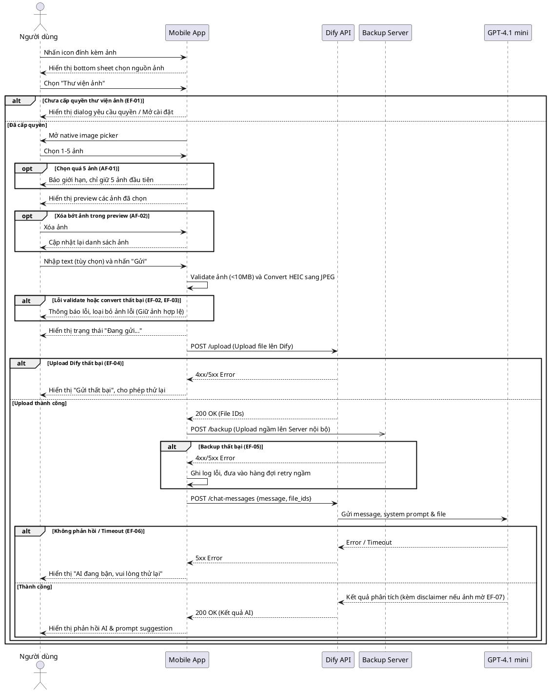

**Description:**
- Người dùng chọn "Thư viện ảnh" để tải lên từ 1 đến 5 bức ảnh. App sẽ kiểm tra quyền truy cập, hiển thị giao diện chọn ảnh và tiến hành validate kích thước (tối đa 10MB) cũng như chuyển đổi định dạng HEIC sang JPEG. Sau khi người dùng nhấn gửi, ứng dụng ưu tiên upload ảnh lên hệ thống Dify. Nếu thành công, một bản sao backup sẽ được đồng bộ ngầm về Server nội bộ, đồng thời tin nhắn chứa ảnh sẽ được gửi qua Dify đến GPT-4.1 mini để phân tích lừa đảo. Kết quả phân tích cuối cùng sẽ được trả về và hiển thị trên màn hình chat kèm theo các gợi ý (prompt suggestion) tiếp theo cho người dùng. Các luồng ngoại lệ như lỗi đường truyền, vượt dung lượng hay quá giờ đều được mô tả bằng khối rẽ nhánh.

**API table:**
| API Name | Purpose | Method | Request Format | Response Format | Authentication | Related Use case |
|----------|---------|--------|----------------|-----------------|----------------|----------------|
| /upload | Upload ảnh lên Dify | POST | `multipart/form-data` (file) | `{ id: string, name: string, size: number, ... }` | Bearer Token | UC-1 |
| /backup | Upload ảnh lên Server nội bộ | POST | `multipart/form-data` (file) | `{ success: boolean }` | Bearer Token | UC-1 |
| /chat-messages | Gửi hội thoại AI qua Dify | POST | `{ query: string, inputs: object, response_mode: string, files: array }` | `{ event: string, message_id: string, answer: string, ... }` | Bearer Token | UC-1 |
