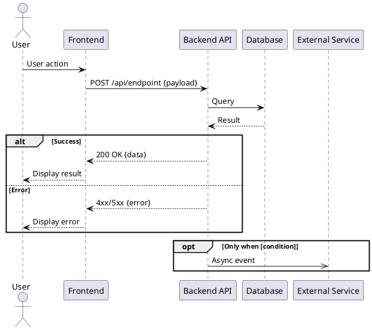

# Sequence Diagram

## Goal:
- Illustrate component/actor interactions in chronological order.  

## Conventions:
- Participants: name after the actual component, not generic labels like "Server".
- Arrow labels: API calls → `METHOD /endpoint`; async → event name; UI → action name.
- `->` for sync; `->>` for async — must be consistent throughout.
- All sync calls must have a `-->` return arrow; never leave one-way.
- Error cases inside `alt` blocks — never in notes only.
- Callout for important error handling or async flows.

## Output format:
- Here is the final output format that you will deliver to users:


```
**Description:**
- [3–5 sentence plain-text summary.]
```

```
**API table:**
| API Name | Purpose | Method | Request Format | Response Format | Authentication |
|----------|---------|--------|----------------|-----------------|----------------|
| /api/users | Create user | POST | {name, email} | {id, status} | JWT Token |
```

### Example: API Table
| API Name | Purpose | Method | Request Format | Response Format | Authentication | Related Use case|
|----------|---------|--------|----------------|-----------------|----------------|----------------|
| /api/auth/register | Create new user account | POST | `{email: string, password: string, name: string}` | `{userId: string, status: "pending_verification"}` | None | UC-001, UC-002 |
| /api/auth/verify | Verify email token | GET | Query: `?token=abc123` | `{success: boolean, message: string}` | Verification Token | None | 
| /api/auth/login | Authenticate user | POST | `{email: string, password: string}` | `{accessToken: string, refreshToken: string, user: {...}}` | None | None | 