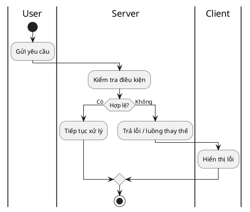

# Activity Diagram (PlantUML)

## Goal:
- Illustrate business process flow including decisions and parallel actions.  

## Conventions:
- Node names: Verb + Noun (e.g., `Send confirmation email`, `Check inventory`).
- Decision nodes: end with `?`; label every branch with condition or yes/no.
- Swimlanes: named by role/actor; use system layer names (FE/BE/External) only when the distinction matters.
- Required: `start`, `stop`/`end`, and at least one error flow path.
- Follow the structure as following **Output format:**

## Output format:
- Here is the final output format that you will deliver to users:

