# diagram-creator SKILL

## Purpose
Create various type of diagrams: sequence diagrams, flowcharts, activity diagrams,... based on user input.

## Workflow

### 1. Receive input
- For each use case/user story, create a dedicated diagram.
- In case there are too many use cases/user stories (more than 5), ask the user which one need to create diagram.
- In case the users don't specify diagram type, ask them to choose one (Sequence/Activity/Entity Relationship Diagram).

### 2. Create diagram

- Use the following template to create the diagram:

| Diagram type | Reference File |
|-------|----------------|
| Sequence Diagram  | `template\Sequence Diagram\sequence_diagram_template.md` |
| Activity Diagram  | `template\Activity Diagram\activity_diagram_template.md` |
| Entity Relationship Diagram  | `template\ERD\ERD_template.md` |

- Don't try to create other diagram types unless user asks for them and provide template.

## Output format
- Output should be in markdown format with language `plantuml`.

```plantuml
@startuml
...
@enduml
```

### 3. Save output
- Save the generated diagram in the user workspace under the `\output\diagram\` directory.
- File name format: `{usecase_name}.md` (e.g. UC-1.md , login.md, chatbot.md). Feel free to set a name that match the requirement.
---