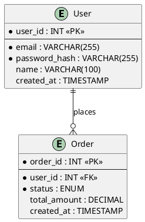

# Entity-Relationship Diagram (ERD)

## Goal:
- Illustrate database entities, their attributes, and relationships.

## Conventions:
- Entity names: PascalCase singular nouns (e.g., `User`, `Order`, `Product`).
- Attribute naming: snake_case (e.g., `created_at`, `user_id`).
- Always show: primary key (PK), foreign keys (FK), and key attributes.
- Relationship labels: verb phrases describing the relationship (e.g., "places", "contains", "belongs to").
- Cardinality: always explicit — use `||--o{`, `||--||`, `}o--o{` etc.

## Output format:
- Here is the final output format that you will deliver to users:


```
**Mô tả:**
- [3–5 sentence summary of the data model.]
- [Notable constraints, indexes, or design decisions.]
```

## Relationship notation:
| PlantUML | Meaning |
|----------|---------|
| `\|\|--o{` | One-to-Many |
| `\|\|--\|\|` | One-to-One |
| `}o--o{` | Many-to-Many |
| `o\|--o{` | Zero-or-One to Many |
