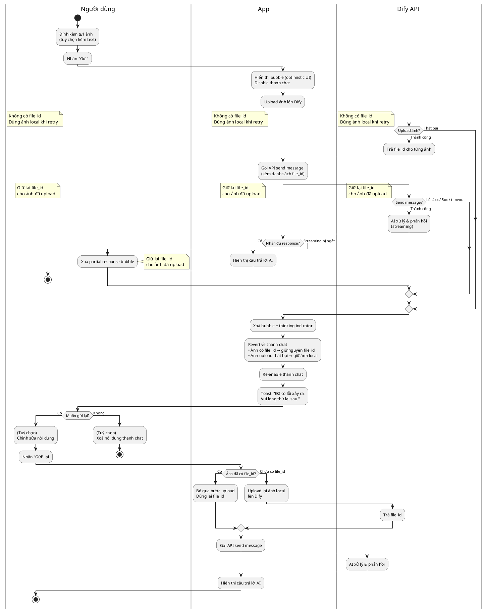

## Activity Diagram — UC-04: Retry tin nhắn có ảnh

```plantuml
@startuml
skinparam swimlaneWidth 220

|Người dùng|
start
:Đính kèm ≥1 ảnh\n(tuỳ chọn kèm text);
:Nhấn "Gửi";

|App|
:Hiển thị bubble (optimistic UI)\nDisable thanh chat;
:Upload ảnh lên Dify;

|Dify API|
if (Upload ảnh?) then (Thành công)
  :Trả file_id cho từng ảnh;
  |App|
  :Gọi API send message\n(kèm danh sách file_id);
  |Dify API|
  if (Send message?) then (Thành công)
    :AI xử lý & phản hồi\n(streaming);
    |App|
    if (Nhận đủ response?) then (Có)
      :Hiển thị câu trả lời AI;
      |Người dùng|
      stop
    else (Streaming bị ngắt)
      :Xoá partial response bubble;
      note right
        Giữ lại file_id
        cho ảnh đã upload
      end note
    endif
  else (Lỗi 4xx / 5xx / timeout)
    note right
      Giữ lại file_id
      cho ảnh đã upload
    end note
  endif
else (Thất bại)
  note right
    Không có file_id
    Dùng ảnh local khi retry
  end note
endif

|App|
:Xoá bubble + thinking indicator;
:Revert về thanh chat\n• Ảnh có file_id → giữ nguyên file_id\n• Ảnh upload thất bại → giữ ảnh local;
:Re-enable thanh chat;
:Toast: "Đã có lỗi xảy ra.\nVui lòng thử lại sau.";

|Người dùng|
if (Muốn gửi lại?) then (Có)
  :(Tuỳ chọn)\nChỉnh sửa nội dung;
  :Nhấn "Gửi" lại;
  |App|
  if (Ảnh đã có file_id?) then (Có)
    :Bỏ qua bước upload\nDùng lại file_id;
  else (Chưa có file_id)
    :Upload lại ảnh local\nlên Dify;
    |Dify API|
    :Trả file_id;
    |App|
  endif
  :Gọi API send message;
  |Dify API|
  :AI xử lý & phản hồi;
  |App|
  :Hiển thị câu trả lời AI;
  |Người dùng|
  stop
else (Không)
  :(Tuỳ chọn)\nXoá nội dung thanh chat;
  stop
endif

@enduml
```
