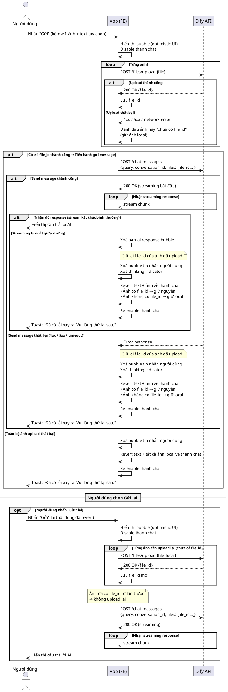

## Sequence Diagram — UC-04: Retry tin nhắn có ảnh

---

**API liên quan:**

| API | Mục đích | Method | Request | Response |
|---|---|---|---|---|
| `/files/upload` | Upload ảnh lên Dify, nhận file_id | POST | `multipart/form-data {file, type: "image"}` | `{id: file_id, name, size, ...}` |
| `/chat-messages` | Gửi tin nhắn kèm ảnh đến AI | POST | `{query, conversation_id, inputs, files: [{type:"image", transfer_method:"local_file", upload_file_id: file_id}]}` | Streaming response |
